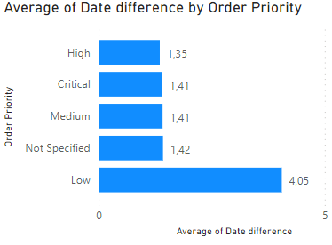

# Office World Supplies Sales Data Analysis

---

## Introduction
This is an Excel and Power BI project of an **imaginary store** called **Office World**. Data set was provided on Skills Bootcamp from We Are Group. The project is to analyse and derive insights to answer crucial questions and help the store make data-driven decision. 

### Company background
Office World, with over 60 years of experience, is a well-established retailer specializing in office supplies and technology products. The company is committed to offering quality products and excellent customer service. 

### Current position
Office World seeks to enhance its marketing efforts by gaining a deeper understanding of product popularity, profitability, and customer preferences. The company aims to leverage this insight to expand its customer base and improve customer satisfaction.

### Company objectives
Office World's primary objectives include identifying in-demand products, maximizing profitability, and reaching new customers through targeted marketing strategies.

## Executive summary

### The problem
Office World aims to analyse its product sales data to identify popular and profitable products and understand its current customer base better.

### The analysis's goal
The objective of this analysis is to assess product popularity, profitability, and customer segmentation to inform marketing strategies and improve product offerings.

### The data and techniques employed
The analysis utilizes sales data including order date, ship date, customer segment, product category, region, quantity ordered, cost of sales, unit price, etc. Techniques such as data cleaning, exploratory data analysis, and visualization were employed to derive insights from the data.

### Brief interpretation of results
The analysis reveals insights into product popularity, profitability, and customer segments. These insights will guide Office World in optimizing its marketing strategy.

## Main body

### Summary of errors in data
The dataset was carefully reviewed for errors and inconsistencies to ensure data accuracy and reliability for meaningful analysis. The errors include:
1. Structural errors:
- Spelling errors (In ship mode there are 2 values that are actually the same (Parcel 2 Go and ParcelToGo), there is only 1 value of Parcel 2 Go, so change it to ParcelToGo);
- Incongruent values (In Product Category there are 2 same values as well. There are Tech and Technology. There is only 1 value for Tech, so change it to Technology).
2. Data types and formats:
- Incorrect data types (In the ship date column there are 2 data types: date and text);
- Incorrect formats (In order date column there are 2 different format of date type).
3. Duplicates:
- More than one instance of the same record of data in a dataset, thus leading to incorrect calculations, results or conclusions (7 duplicates values were found in the dataset).

### Additional calculations and columns
Additional calculated columns were made:
- Date difference (difference between Ship date and Order date);
- Total costs ((Cost of Sales + Shipping Cost) *(1-discount));
- Sales Revenue (Quantity ordered * Unit Price);
- Profit (Sales Revenue - Total costs).

### Hypothesis
- **Correlation between order priority and date difference** (This question explores whether there is a relationship between the urgency of order priority and the time it takes for orders to be shipped, which can inform decision-making regarding order processing efficiency);
- **Correlation between ship mode and date difference** (This question investigates whether the chosen shipping mode affects the time it takes for orders to be shipped, which can impact logistics and customer satisfaction);
- **Is there a relationship between the quantity of products ordered and the discount offered?** (This question examines whether there is a correlation between the quantity of products ordered and the discount offered, which can influence purchasing behaviour and pricing strategies);
- **Which product sub-category, product category and customer segment are the best-selling and are most profitable (worst selling)** (This question aims to identify the top-performing and underperforming product sub-categories, categories, and customer segments in terms of sales and profitability, guiding resource allocation and marketing efforts);
- **Which regions have the highest and lowest sales and profits?** (This question analyses regional sales and profitability data to identify geographic trends and opportunities, helping prioritize markets and allocate resources effectively);
- **How does the unit price of products vary across different product sub-categories?** (This question examines the variability in unit prices across different product sub-categories, providing insights into pricing strategies and market dynamics within specific product categories);
- **Trends or patterns in sales, profits over time (monthly, quarterly)** (This question explores temporal trends and patterns in sales and profits over time, allowing for the identification of seasonality, growth trends, or other cyclical patterns that can inform strategic decision-making and resource planning).

## Analysis

    

The data presented in the chart indicates a notable correlation between the date difference and order priority. Specifically, orders with low priority exhibit a higher average date difference, around 4 days, whereas orders with high and critical priority show substantially lower average date differences, ranging between 1.3 to 1.4 days.
