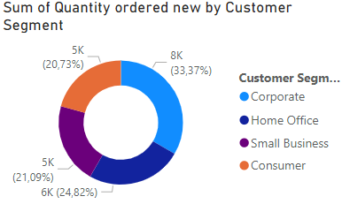
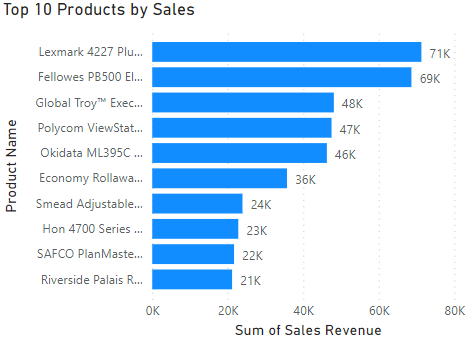

# Office World Supplies Sales Data Analysis

---

## Table of Contents
* [Introduction](#introduction)
    * [Company background](#company-background)
    * [Current position](#current-position)
    * [Company objectives](#company-objectives)
* [Executive summary](#executive-summary)
    * [The problem](#the-problem)
    * [The analysis's goal](#the-analysiss-goal)
    * [The data and techniques employed](#the-data-and-techniques-employed)
    * [Brief interpretation of results](#brief-interpretation-of-results)
* [Main body](#main-body)
    * [Summary of errors in data](#summary-of-errors-in-data)
    * [Additional calculations and columns](#additional-calculations-and-columns)
    * [Hypothesis](#hypothesis)
* [Analysis](#analysis)
    * [Written insights](#written-insights-explaining-the-outcomeresults-of-each-analysis-and-response-to-hypothesis)
* [Conclusion](#conclusion)
* [Recommendations for action](#recommendations-for-action)
* [Dashboard](#dashboard)

## Introduction
This is an Excel and Power BI project of an **imaginary store** called **Office World**. Data set was provided on Skills Bootcamp from We Are Group. The project is to analyse and derive insights to answer crucial questions and help the store make data-driven decision. 

### Company background
Office World, with over 60 years of experience, is a well-established retailer specializing in office supplies and technology products. The company is committed to offering quality products and excellent customer service. 

### Current position
Office World seeks to enhance its marketing efforts by gaining a deeper understanding of product popularity, profitability, and customer preferences. The company aims to leverage this insight to expand its customer base and improve customer satisfaction.

### Company objectives
Office World's primary objectives include identifying in-demand products, maximizing profitability, and reaching new customers through targeted marketing strategies.

## Executive summary

### The problem
Office World aims to analyse its product sales data to identify popular and profitable products and understand its current customer base better.

### The analysis's goal
The objective of this analysis is to assess product popularity, profitability, and customer segmentation to inform marketing strategies and improve product offerings.

### The data and techniques employed
The analysis utilizes sales data including order date, ship date, customer segment, product category, region, quantity ordered new, cost of sales, unit price, etc. Techniques such as data cleaning, exploratory data analysis, and visualization were employed to derive insights from the data.

### Brief interpretation of results
The analysis reveals insights into product popularity, profitability, and customer segments. These insights will guide Office World in optimizing its marketing strategy.

## Main body

### Summary of errors in data
The dataset was carefully reviewed for errors and inconsistencies to ensure data accuracy and reliability for meaningful analysis. The errors include:
1. Structural errors:
- Spelling errors: In the 'Ship Mode' column, there are two values that are identical ('Parcel 2 Go' and 'ParcelToGo'). Since there is only one occurrence of 'Parcel 2 Go', I changed it to 'ParcelToGo';
- Incongruent values: In the 'Product Category' column, there are two similar values ('Tech' and 'Technology'). As there is only one occurrence of 'Tech', I changed it to 'Technology'.
2. Data types and formats:
- Incorrect data types: In the 'Ship Date' column there are 2 data types: date and text);
- Incorrect formats: In 'Order Date' column there are 2 different format of date type.
3. Duplicates:
- More than one instance of the same record of data in a dataset, thus leading to incorrect calculations, results or conclusions (7 duplicates values were found in the dataset).

### Additional calculations and columns
Additional calculated columns were made:
- Date difference (difference between Ship date and Order date);
- Total costs ((Cost of Sales + Shipping Cost) *(1-discount));
- Sales Revenue (Quantity ordered new * Unit Price);
- Profit (Sales Revenue - Total costs).

### Hypothesis
- **Correlation between order priority and date difference** (This question explores whether there is a relationship between the urgency of order priority and the time it takes for orders to be shipped, which can inform decision-making regarding order processing efficiency);
- **Correlation between ship mode and date difference** (This question investigates whether the chosen shipping mode affects the time it takes for orders to be shipped, which can impact logistics and customer satisfaction);
- **Is there a relationship between the quantity of products ordered and the discount offered?** (This question examines whether there is a correlation between the quantity of products ordered and the discount offered, which can influence purchasing behaviour and pricing strategies);
- **Which product sub-category, product category and customer segment are the best-selling and are most profitable (worst selling)** (This question aims to identify the top-performing and underperforming product sub-categories, categories, and customer segments in terms of sales and profitability, guiding resource allocation and marketing efforts);
- **Which regions have the highest and lowest sales and profits?** (This question analyses regional sales and profitability data to identify geographic trends and opportunities, helping prioritize markets and allocate resources effectively);
- **How does the unit price of products vary across different product sub-categories?** (This question examines the variability in unit prices across different product sub-categories, providing insights into pricing strategies and market dynamics within specific product categories);
- **Trends or patterns in sales, profits over time (monthly, quarterly)** (This question explores temporal trends and patterns in sales and profits over time, allowing for the identification of seasonality, growth trends, or other cyclical patterns that can inform strategic decision-making and resource planning).

## Analysis

    

The data presented in the chart indicates a notable correlation between the date difference and order priority. Specifically, orders with low priority exhibit a higher average date difference, around 4 days, whereas orders with high and critical priority show substantially lower average date differences, ranging between 1.3 to 1.4 days.

    
    

Similar analysis was conducted to investigate the correlation between ship mode and date difference. The data suggests that there is minimal variation in date differences, ranging from 1 to 2 days across different ship modes. Notably, Royal Mail exhibits the highest average date difference, nearly 2 days. However, upon closer examination, it is evident that Royal Mail also handles the largest number of orders (1280), which may vary significantly in priority. Therefore, it is reasonable to infer that there is no significant correlation between ship mode and date difference.

    

    

To examine the relationship between the quantity of products ordered and the discount offered, I created a pivot table and conducted a correlation analysis. The pivot table reveals that there is only one order for a product with a 17% discount and just ten orders for products with a 21% discount. While these numbers may initially seem like outliers, upon closer examination, they do not appear to significantly skew the data. Furthermore, the correlation analysis revealed that there is no correlation between the quantity ordered and the discount percentage. Despite the common assumption that higher discounts might lead to larger quantities ordered, this analysis suggests otherwise.

Overall, the purpose of this analysis was to investigate whether higher discounts influence the quantity of ordered products. However, the findings indicate that discount percentage alone may not be a significant driver of order quantity.

    
    

    
    

The analysis of the provided charts reveals that the Technology category emerges as both the most selling and most profitable product category. Despite Office Supplies being the most ordered category, its comparatively lower average unit price results in smaller profits.

    
    

The charts above indicate that the Telephones and Communication, along with Office Machines, emerge as the most profitable sub-categories.

    
    

    
    

The analysis of the provided charts reveals that the Corporate customer segment emerges as both the most selling and most profitable. While the Consumer segment has the highest average unit price, its smaller quantity of orders results in comparatively lower sales and profit.

    
    

Charts above shows top products by sales and by profit.

    
    

The treemaps clearly indicate that the East region leads in terms of sales, while the West region emerges as the most profitable.

    

The chart above illustrates significant variability in unit prices among different product sub-categories. Notably, Copiers and Fax and Office Machines emerge as the most expensive sub-categories, indicating a clear division between more and less expensive product categories.

    
    

    
    

The charts show the trends over time for sales, profit, unit price, and quantity ordered. Notably, January and March exhibit the smallest sales figures, attributed to higher unit prices and lower quantities ordered during these months. In February, a decrease in unit price, coupled with a rise in the quantity of orders, resulted in increased sales and profit. May shows the smallest average unit price and the highest quantity of orders, leading to a small increase in profit but a decline in sales.
Furthermore, the data indicates a 17.5% growth in sales during the second quarter compared to the first quarter. However, profit experienced an 18% decline during this period.

### Written insights explaining the outcome/results of each analysis and response to hypothesis
- **Correlation between order priority and date difference**: There is a correlation between order priority and date difference, particularly noticeable in low-priority orders. However, the difference in shipping time between high, critical, and medium priority orders is not significant.
- **Correlation between ship mode and date difference**: There is no correlation between ship mode and date difference, indicating that the chosen shipping method does not significantly impact the time it takes for orders to be shipped.
- **Relationship between quantity of products and discount**: There is no correlation between the quantity of products ordered and the discount offered, suggesting that discount offers do not influence the quantity of products ordered.
- **Best and worst performing product categories and customer segments**: The top-performing product category in terms of sales and profit is technology, while the underperforming category is office supplies. Similarly, the corporate customer segment performs best in both sales and profit, while the consumer segment underperforms.
- **Regions with highest sales and profits**: The region with the highest sales is the East, whereas the region with the highest profit is the West.
- **Variability in unit prices across product sub-categories**: The most expensive product sub-categories are copiers and fax, and office machines, indicating higher pricing for these items compared to others.
- **Trends in sales and profits over time**: Sales show a growth of 17.5% in the 2nd quarter compared to the 1st quarter. However, there is a notable decline in profit by 18% during the same period.

## Conclusion
The analysis highlights opportunities for Office World to focus its marketing efforts on promoting top-selling and high-profit products to its target customer segments. By understanding customer preferences and purchasing patterns, Office World can tailor its marketing campaigns to better meet customer needs and drive sales.

## Recommendations for action
Based on the analysis findings, recommendations for action include:
- Developing targeted marketing campaigns to promote top-selling products to specific customer segments;
- Expanding product offerings in high-demand categories to capitalize on market trends and customer preferences;
- Implementing pricing strategies to optimize profitability while maintaining competitive pricing;
- Investing in customer relationship management (CRM) systems to personalize marketing communications and improve customer engagement.

## Dashboard

---
